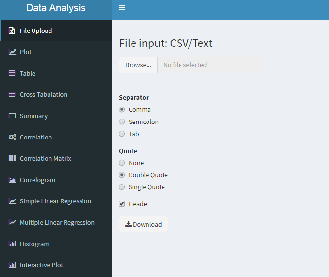

# Statistics Application

This application is able to perform basic statistical analysis for an end user. Statistical calculations such as correlation, cross-tabulation, simple linear regression, multiple linear regression and visualization are able to be performed. The user simply needs to format their data into **.csv** or **.txt** file and then begin their analysis. 

**Note: The maximum upload size for a file is currently unknown.**

### File Upload

+ This tab allows a user to upload a .csv file or .txt file to the appliacation to perform basic statistical analysis. 

### Plot

+ This tab allows a user to create an interactive plot of their data. The plot can utilize dots, line, and bars to display the data. The user is able to select the color of the data as well as the size of the dots on the scatter plot. The plot is available for download via the **Download Plot** button. 

---

---
### Table

+ This tab allows the user to view their data in a table format. 

---
### Cross Tabulation

+ This tab allows a user to perform a cross-tabulation analysis of their data. 

---
### Summary

+ This tab displays a basic statistical summary of all of the data the user has uploaded. 

---
### Correlation

+ This tab runs a correlation on the data that has been uploaded and is interactive and changeable by the user. 

----

### Correlation Matrix

+ This tab displays an overall correlation matrix of the uploaded data. 

----

### Correlogram

+ This tab displays an interactive correlogram of the data. The user can select different correlogram features such as **shade** or ellipsis**.

---

### Simple Linear Regression

+ This tab allows a user to perform a simple linear regression on their data. The function is interactive and allows the user to select their **independent** and **dependent** variables. 

---

### Multiple Linear Regression

+ This tab allows a user to perform a multiple linear regression on their data. The function is interactive and allows for up to **4** predictors to be selected by the user. 

---

### Histogram

+ This tab displays a histogram to the end user and is interactive and downloadable. 

---

### Interactive Plot

+ This tab displays an interactive plot for the end user that can be customized as they so choose. The plot is interactive and allows the user to update the plot as they see fit. 

---
